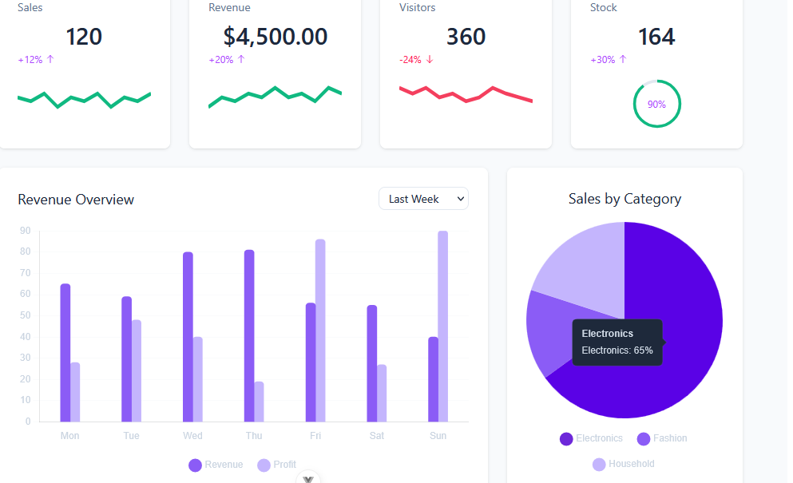
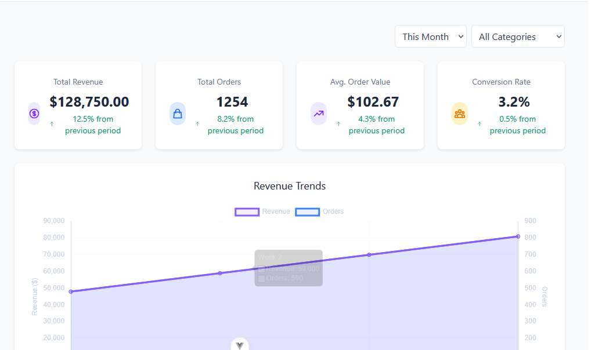
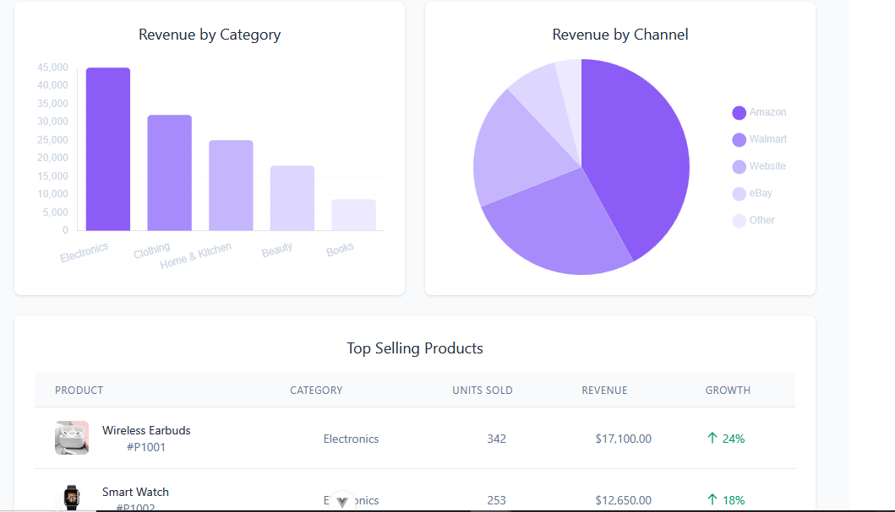
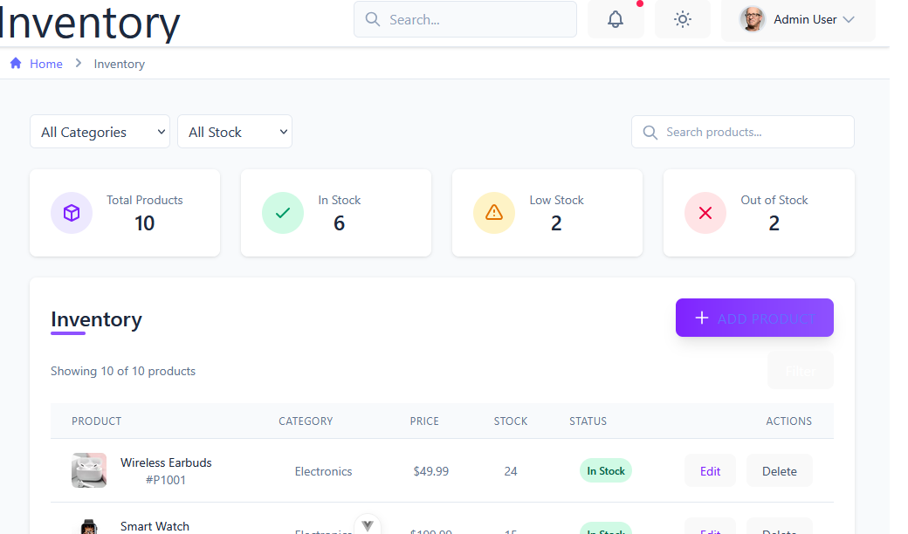
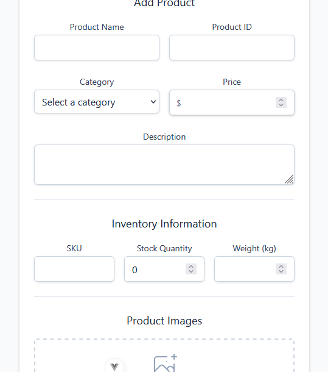

# Design Document – Dashboard Project

---
##  Design Choices

### Tech Stack
- **Vue.js** for building interactive UIs with components.
- **Tailwind CSS** for utility-first, responsive styling.
- **Dark Mode Support** for accessibility and user preference.

### Layout Strategy
- **Sidebar Navigation** with routes for Dashboard, Analytics, Products, Inventory, and Settings.
- **Header** with time-range selector, user menu, and theme toggle.
- **Component-Based Structure** for reusability (cards, tables, charts, etc.).

---

## Challenges & Solutions

### 1. **Layout Padding Issues**
- **Issue**: Gaps between sidebar and header due to `pl-*` or `ml-*` classes.
- **Fix**: Applied `pl-0`, `ml-0`, and `w-full` where necessary to eliminate spacing.

### 2. **Dark Mode Consistency**
- **Issue**: Some elements didn't adapt to theme.
- **Fix**: Standardized use of `bg-white dark:bg-slate-800` and `text-slate-800 dark:text-slate-200`.

### 3. **Responsive Tables**
- **Issue**: Product and inventory tables broke on small screens.
- **Fix**: Used `overflow-x-auto` and `min-w-full` with Tailwind for scrollable tables.

---

## Dashboard Pages & Functionality

---

### 🖥️ 1. Dashboard Home

**Functionality:**
- Metrics summary (e.g. Revenue,Profit).
- Time range filter (`Today`, `Week`, `Month`, `Year`).
- Visualization charts for trends and engagement.

---

### 📊 2. Analytics / Reports

**Functionality:**
- Detailed data charts.
- Filters for time range and categories.
- Comparative analytics (e.g. monthly vs. previous month).

---

### 🛒 3. Product Management

**Functionality:**
- Edit and delete products.
- Product list with name, price, category, status.
- Search and filter by category or availability.

---

### 🏷️ 4. Add Product

**Functionality:**
- Add new Product to inventory.
- Picture upload.
- Form submission.

---

## 📌 Summary

The dashboard now includes:
- A real-time **analytics view**
- Fully featured **Product Management**
- A responsive, theme-aware layout

These enhancements make the dashboard suitable for small to mid-scale business operations, enabling streamlined management of products, stock, and performance metrics.

---
